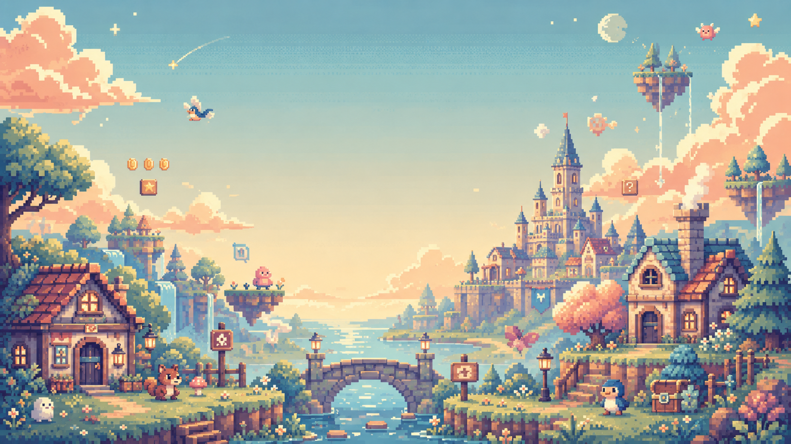
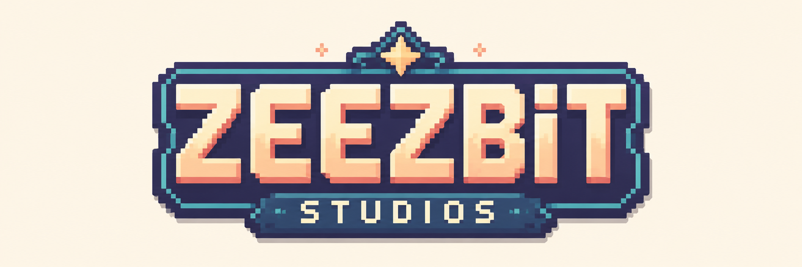

# quench

**A small studio's machine for building and shipping tiny browser games on a 2-day clock.**

[](https://zeezbitstudios.itch.io)


▶ **[Play](https://zeezbitstudios.itch.io)** · 📓 **[Devlog](devlogs/00-dodger/index.md)** · 🔧 **[How it's built](#how-its-built)**

---

## What this is

I kept *starting* games and never *finishing* them. quench is the fix: a rule that
every game has to be small, complete, and live on a page someone can click — no
dream engine, no five-year roadmap.

So this repo isn't one game. It's the pipeline that ships a new tiny game on a
weekend, over and over, without the project bloating until it dies. Each game is a
single mechanic on a single screen, made of plain shapes, finished and put online.

## How it works

- **The weekend loop.** Friday: write the spec, decide the one mechanic, stop.
  Saturday: build only that. Sunday: tune the difficulty, add the juice, ship it.
- **Scope is law.** Every game has a `SPEC.md` that names exactly one mechanic, one
  screen, one way to win or lose. If a "nice idea" isn't in the spec, it doesn't get
  built — it goes on an out-of-scope list. That single rule is what keeps a small
  game small enough to finish.
- **Primitives first.** No sprites, no downloaded art (for the early games). Rectangles
  and circles, drawn from a fixed six-colour palette. To change the look you reassign a
  colour, you don't add a file. Colour and motion *are* the art.
- **A frozen template that earns its parts.** `template/` is the shared scaffold —
  scenes, game-feel, input, scoring. It only grows from code that already shipped in a
  real game, never from "we might need this later".

## The games

| Game | What it teaches | Status |
|------|-----------------|--------|
| **00-dodger** | The whole pipeline end to end: real-time loop, score, restart, build, ship. Deliberately teaches no new mechanic — its job is to make the machine work once. | **Shipped** — [play](https://zeezbitstudios.itch.io/dodger) |
| **01-mixer** | A real scoring function. Mix colours to match a target — and the catch is that naive RGB distance is *perceptually wrong*, so it scores in CIELAB (ΔE). | Designed |
| **02-bloom** | A simulation that runs itself. A double-buffered grid running Conway's Game of Life; you only seed it and nudge it. | Designed |

More are queued after a review once the first three ship. The build order lives in
[`SETUP.md`](SETUP.md).

## How it's built

The stack is **Phaser 4 + TypeScript + Vite** — browser-native, no install for the
player, fast to build and zip.

The part worth calling out: quench is built *with* an AI coding agent
([Claude Code](https://claude.com/claude-code)), but on a short leash. Three roles are
kept separate so the agent doesn't grade its own homework — **plan**, **implement**, and
an independent **review**. On top of that, project-local skills act as guardrails:

- **`phaser4-guard`** — Phaser 4 is new and most models were trained on Phaser 3, so they
  reach for old APIs by reflex. This skill catches v3 calls and points at the v4 replacement.
- **`ponytail`** — a review pass whose only job is to delete over-engineering: reinvented
  standard library, abstractions with one user, flexibility nothing asked for.
- **`plan-gate`** — pressure-tests a game's scope on Friday, *before* any code exists.

The skills are guardrails. The discipline — one mechanic, ship it — is the actual point.

## Repo layout

```
quench/
├── games/            one folder per game (each has its own SPEC.md + CLAUDE.md)
│   ├── 00-dodger/    shipped: the pipeline game
│   ├── 01-mixer/     spec only (next up)
│   └── 02-bloom/     spec only
├── template/         frozen Phaser 4 scaffold (scenes, feel/, lib/) every game copies
├── devlogs/          post-ship write-ups + screenshots
├── .claude/          project-local skills (phaser4-guard, ponytail, plan-gate)
├── SETUP.md          the operating manual: setup, the weekend loop, deploy
├── CONVENTIONS.md    the frozen template contract (layout, config, palette, APIs)
├── ART.md            studio art bible (palette, motion, the deferred pixel era)
└── SPEC.template.md  the per-game contract you fill in for a new game
```

## Run a game locally

Needs **Node 20+**.

```bash
cd games/00-dodger
npm install
npm run dev          # dev server on http://localhost:8080, hot reload
npm run build        # production build into dist/ (this is what gets zipped to itch)
```

## The palette

Six colours, locked. The studio's whole face. Defined in `lib/palette.ts`.

```
bg    #14131a   near-black base
ink   #e8e6e3   text / UI
hot   #ff5d5d   danger / the player's stake
cool  #4ec9b0   safe / target / success
warn  #ffd166   score pops / highlights
mute  #6b6a78   inert / hazard fill / disabled
```

## More

- [`SETUP.md`](SETUP.md) — full operating manual and the weekend loop.
- [`CONVENTIONS.md`](CONVENTIONS.md) — folder layout, game config, the shared APIs.
- [`ART.md`](ART.md) — the art direction and why it's locked.
- Studio page: **[zeezbitstudios.itch.io](https://zeezbitstudios.itch.io)**

---

<a href="https://zeezbitstudios.itch.io"></a>

A Zeezbit Studios project. MIT licensed — see [`LICENSE`](LICENSE).
