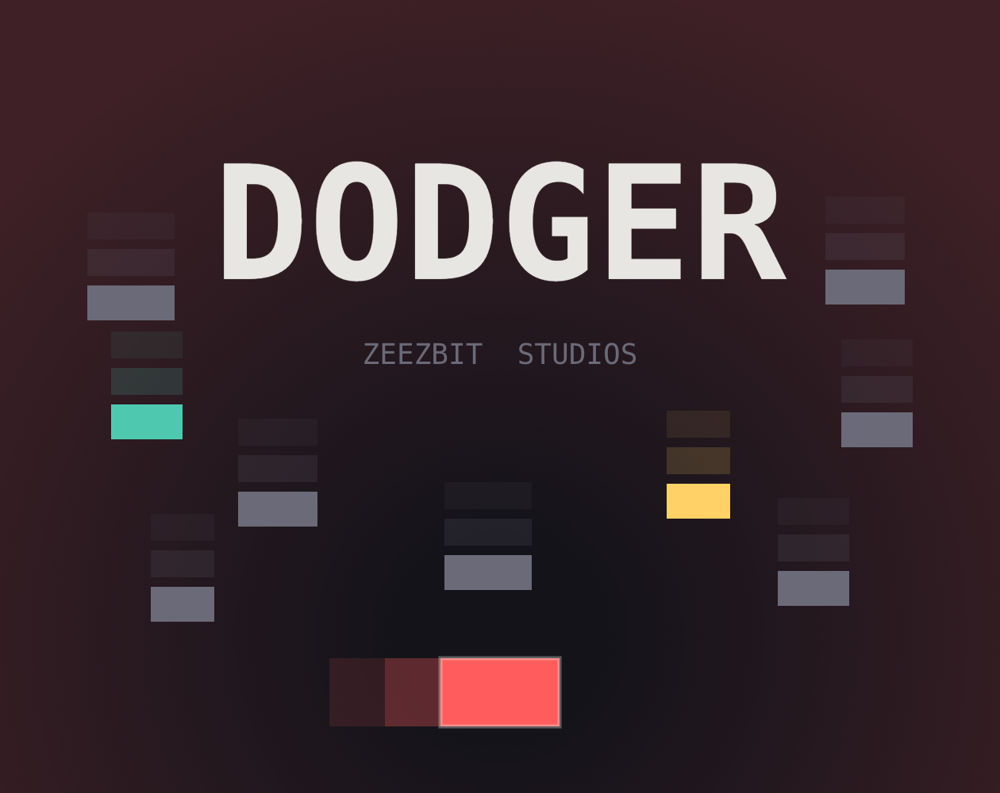
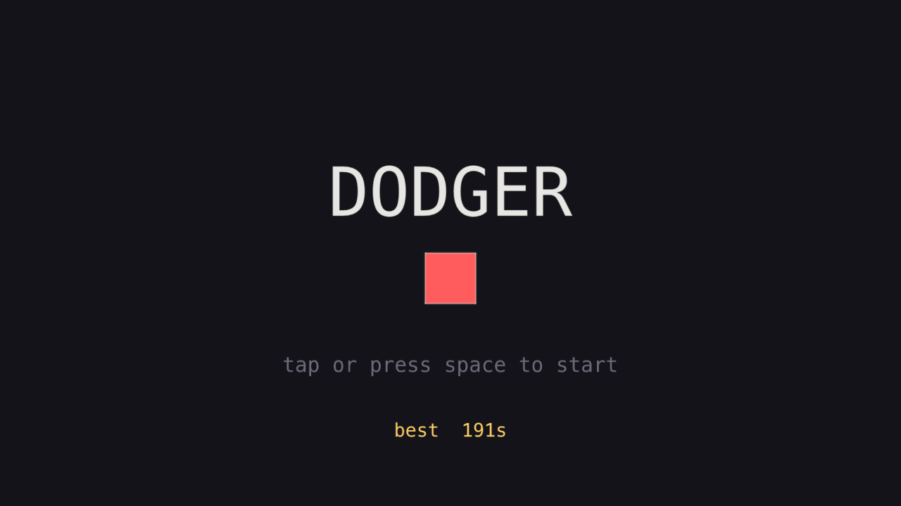
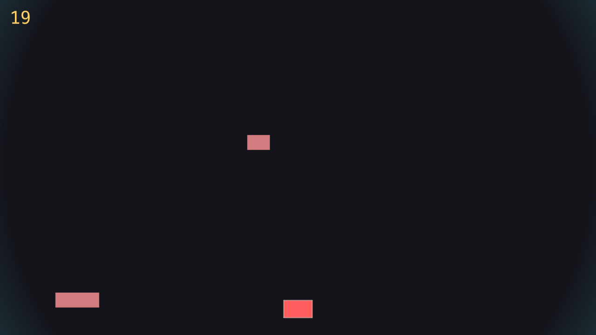
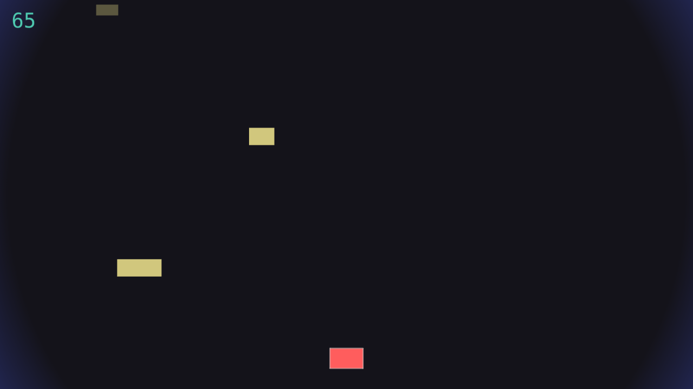

# DODGER — shipping game zero

I wanted to stop *starting* games and start *finishing* them. So I gave myself a rule:
ship a tiny game, end to end, onto a real page someone can click. No engine of my dreams,
no five-year roadmap. Just the smallest complete thing.

This is that thing.

**▶ Play it in your browser:** [zeezbitstudios.itch.io/dodger](https://zeezbitstudios.itch.io/dodger)

## What it is

A block slides left and right along the bottom of the screen. Blocks fall from the top.
You don't get hit. It gets faster. You survive as long as you can, and the clock is your
score.

That's the entire game. One mechanic, one screen, endless. You move; you don't die. The
high score is whole seconds, and it sticks around in your browser so you have something to
be annoyed about next time.

## Why game zero is boring on purpose

DODGER is the first game in a project I call **quench** — a little build-and-ship machine
for 2-day mini-games. And game zero's job is *not* to be clever. It teaches nothing new
mechanically, deliberately.

Its job is to make the whole machine work once: title card → game → game over → restart →
score that persists → scaling that fits any screen → a production build → a zip → an
itch.io page that actually loads. Every one of those steps is a place a project quietly
dies. So game zero exists to kill all of them at once, on the dumbest possible game, where
nothing about the *design* can distract me from the *pipeline*.

The payoff is the next game. Game one starts at "build the mechanic" instead of "wire the
machine," because the machine already exists and has been proven on something shipped.

## How it's built

- **Phaser 4 + TypeScript + Vite.** Strict types, fast bundler, builds to a folder I drag
  onto itch.
- **Primitives only. Zero art.** No sprites, no images, nothing to download. Everything
  you see is a rectangle or a circle drawn at runtime, coloured from a fixed six-colour
  studio palette. The colour *is* the art direction: red kills, teal is safe, yellow is
  feedback. Recolouring is the whole visual language.
- **Rendered at 1920×1080** and scaled to fit, so the shapes and text stay crisp on big
  and retina screens instead of looking like an upscaled phone game.

The actual deliverable of game zero isn't DODGER — it's two reusable folders that every
future game copies:

- **`feel/`** — the game-feel kit: screen shake, a one-shot particle burst, hitstop
  (the tiny freeze-frame on impact), and sound. All sound is synthesised WebAudio blips,
  so there are still zero asset files. DODGER uses exactly two: a *start* blip and a
  *hit* blip.
- **`lib/`** — the plumbing: a single input abstraction (the block follows your
  pointer/finger x, with arrow keys as a backup), persistent high score, the palette, and
  reduced-motion detection.

Build these once, build them well, never rewrite them. That's the entire idea.

## Making one rectangle feel alive

Here's the fun part. The mechanic is trivial, so all the craft goes into *feel* — making a
red rectangle feel like a thing with weight and nerves.

The player block squashes and stretches when it moves, leans into the direction it's
going, bobs gently when idle, and lets out a little comic "breath" if you move and then
hold still. Hazards fade in before they're solid, so they telegraph instead of ambush.
Death is loud on purpose: a flash, a burst of particles, a spin-out, then the game-over
screen. A small pop when you cross a score milestone. A motion trail behind you.

The harder problem was the *long run*. The difficulty stops ramping around 45 seconds — so
what carries a two-minute survival? The world slowly changes. A vignette drifts a full hue
wheel roughly every 40 seconds. A background "beat" pulse quietly quickens. The falling
blocks are tinted to the *complement* of the vignette, so they're always contrasting,
never camouflaged. The fall speed rides a gentle wave instead of sitting flat. And little
quirky one-liners appear at random intervals — pulled from a shuffled bag so they don't
clump.

You can watch the world drift across a run — same game, very different mood:

  
  

<video controls autoplay muted loop playsinline width="100%">
  <source src="./images/gameplay.mp4" type="video/mp4" />
  <source src="./images/gameplay.webm" type="video/webm" />
  Your browser doesn't support embedded video — <a href="./images/gameplay.mp4">watch the clip</a>.
</video>

## Things that broke, and how I fixed them

A devlog that only lists features is lying. Here's what actually went wrong:

- **A camera-zoom flourish crashed the game.** I had a punchy zoom on certain beats; it
  threw and took the run down with it. Lazy fix: I deleted it. The cheaper effects (shake,
  flash, burst) already carried the impact, so the zoom wasn't earning its risk.
- **Fast blocks juddered.** I'd turned on pixel-rounding for crispness, but it made
  fast-moving rectangles smear and stutter. Turning it *off* for this game gave smooth
  motion. Crispness lost the argument to feel.
- **The mood vignette was invisible.** The tension vignette I was so proud of simply
  wasn't rendering — it was there in code, doing nothing on screen. Fixed so it actually
  reads as a darkening at the edges.
- **The keyboard felt twitchy.** Arrow/A-D movement was too fast and overshot. I slowed it
  down and added *hold-Shift for fine control*, so you can make small corrections in a
  tight spot.
- **On mobile, your finger covered the action.** Touching to move meant your thumb sat
  right on top of the thing you were trying to watch. I switched to *relative drag* — touch
  anywhere and drag, and the block moves relative to your finger, which stays off the play
  area. Then locked zoom and added a "rotate to landscape" hint.
- **Screen shake and pulsing can make people sick.** So the game reads the OS *Reduce
  Motion* setting and respects it — the shake softens into a flash, and the squash, pulse,
  and trail all tone down. Accessibility wasn't a feature request; it's just not optional.

## Built with an AI workflow (and kept honest by it)

I built this with Claude Code, but not in the "AI, make me a game" sense — that produces
mush. I ran it as a disciplined pipeline with three separated roles: a **planner** that
designs before any code is written, an **implementer** that follows the approved plan, and
a **reviewer** that critiques work it didn't author. You don't approve your own code.

Two project-local rules did most of the work:

- **Scope is law.** Every game has a SPEC with a hard scope cap. If a "nice touch" exceeds
  it, the tooling is instructed to *stop and ask*, not build it. That's how a dodger game
  stays a dodger game instead of growing power-ups and a settings menu at 2am.
- **Lazy on purpose.** A YAGNI/"ponytail" review pass actively hunts for over-engineering —
  reinvented standard library, abstractions with one user, flexibility nothing needs — and
  deletes it. The best code is the code I never wrote.

The AI didn't design DODGER. It kept the machine from sprawling, which on a solo hobby
project is the thing that actually kills you.

## A couple of secrets

Because a shipped game should have at least one. There's a Konami code on the menu (you'll
know), and if you make it to 42 seconds, the game has something reassuring to tell you.
Both are visual-only — they never touch fairness, scoring, or sound.

## Accessibility note

> **Motion note:** This game uses screen shake and pulsing visual effects. If you're
> sensitive to motion, enable your OS **"Reduce Motion"** setting before playing — the
> game detects it and automatically softens the shake (into a flash) and tones down the
> squash/pulse/trail effects.
>
> macOS: System Settings → Accessibility → Display → Reduce Motion. Windows: Settings →
> Accessibility → Visual effects → Animation effects off. iOS/Android have equivalents.

## What's next

Game one inherits this whole template, so it gets to start at the part that's actually a
game. That's the entire reason game zero was worth shipping: it was never about the
dodging. It was about proving the machine, once, on a real link.

---

**Play DODGER** → [zeezbitstudios.itch.io/dodger](https://zeezbitstudios.itch.io/dodger)
· **Studio** → [zeezbitstudios.itch.io](https://zeezbitstudios.itch.io)
· **Me** → [rzaman.site](https://rzaman.site/)
